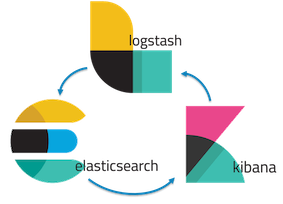

# AWS-ELK Stack

[](https://www.elastic.co/what-is/elk-stack)

# Table of Contents
1. [Description](#Description)
2. [Deployment](#Deployment)
3. [CLI](#CLI)
4. [Kibana](#Kibana)

---

## Description
ELK stack is data analysis orchestration service that runs three different components (Elasticsearch, Logstash & Kibana) to feed data, process and do indexation and finally display on a frontend client that enables end user to create different visualizations of the data.

Diferente user cases for ELK might be:
- Consolidate different logs from different sources with same schema or different and try to visualize at glance for audit purposes.

- Identify KPIs to given stakeholders the right tools in order to make strategic decisions on daily basis

- Apply Machine Learning techniques on custom subsets of data and get insights about possible data issues

This AWS-ELK is just an ELK stack that utilizes the Elasticsearch to consume logs from AWS services like CloudTrail & VPCFlowLogs.

---

## Deployment
The ELK stack is setup in multicontainer and then running on ECS service. 

---

## CLI

Open a console under same path as templates.

Files:
* deployment/templates/ecs-deployment-host.yaml
* deployment/templates/parameters.cfg
* deployment/templates/ecs-deployment-fargate.yaml
* deployment/templates/parameters-fargate.cfg

#### Cloudformation

You can create using EC2 registered instance or Fargate:

##### EC2 Instance cluster
```
aws --profile nc-inaki cloudformation deploy --template-file ecs-deployment-host.yaml --stack-name ecs-elk --parameter-overrides $(cat parameters-host.cfg) --capabilities CAPABILITY_NAMED_IAM

aws --profile nc-inaki cloudformation deploy --template-file ecs-deployment-host-demo.yaml --stack-name ecs-elk-demo --parameter-overrides $(cat parameters-host-demo.cfg) --capabilities CAPABILITY_NAMED_IAM
```

##### Fargate Instance cluster
```
aws --profile nc-inaki cloudformation deploy --template-file ecs-deployment-fargate.yaml --stack-name ecs-elk --parameter-overrides $(cat parameters-fargate.cfg) --capabilities CAPABILITY_NAMED_IAM
```

---

## Kibana

Before use Kibana, there is a requirement to create an index pattern. So, for that this steps will create an index and push some data.

#### Initial setup

1. Create a temp variable. (Obviously this can be arranged with a permanent CNAME record on R53 service that points to the ELB DNS)
```
ELASTICSEARCH=$(aws --profile nc-inaki cloudformation describe-stacks --stack-name ecs-elk | jq -r ".Stacks[].Outputs[] | select(.OutputKey==\"PublicURL\") | .OutputValue")

ELASTICSEARCH=$(aws --profile nc-inaki cloudformation describe-stacks --stack-name ecs-elk-demo | jq -r ".Stacks[].Outputs[] | select(.OutputKey==\"PublicURL\") | .OutputValue")
```

2. Test the access url for Kibana frontend and Elasticsearch:

```
curl -f http://$ELASTICSEARCH

curl -f http://$ELASTICSEARCH:9200

open http://$ELASTICSEARCH
```

3.1 Create VPCFlowlogs index
```
curl $ELASTICSEARCH:9200/vpclogs?pretty -H 'Content-Type: application/json' -d'{"mappings": {"doc": {"properties": {"account-id": {"type": "long"},"protocol": {"type": "integer"},"srcaddr": {"type": "keyword"},"dstaddr": {"type": "keyword"},"start": {"type": "date"},"end": {"type": "date"}}}}}' -XPUT
```

3.2 Create CloudTraillogs index (NOTE: Not needed)

3.3 Create Kinesis logs index
```
curl $ELASTICSEARCH:9200/kinesislogs?pretty -H 'Content-Type: application/json' -d'{"mappings": {"doc": {"properties": {"id": {"type": "integer"},"s3filename": {"type": "keyword"},"instanceId": {"type": "keyword"},"logdate": {"type": "date"},"logdateDesc": {"type": "keyword"},"hostname": {"type": "keyword"},"description": {"type": "keyword"}}}}}' -XPUT
```

4. Now everything is ready to dump data. Checkout [Golang](#Golang)

```
cd /Users/inaki-office/Documents/development/vscode_workspaces/other/aws-elk-ecs-master/data-wrapper

# Pushing VPC flow logs data
go run *.go 2021/01/05 IT-PROD LOG_VPC_FLOW_LOGS $ELASTICSEARCH upm

# Pushing CloudTrail logs data
go run *.go 2021/01/10 IT-TEST LOG_CLOUDTRAIL_EVENTS $ELASTICSEARCH upm

# Pushing Privx Kinesis logs data
go run *.go 2021/01/12 SSEMEA LOG_KINESIS_SSH_LOGS $ELASTICSEARCH kone

```

5. Create index pattern:

```
open http://$ELASTICSEARCH

curl -X POST http://$ELASTICSEARCH/api/saved_objects/index-pattern -H 'kbn-xsrf: reporting' -H 'Content-Type: application/json' -d' {"attributes":{"title":"vpclogs*","timeFieldName":"start"}}'

curl -X POST http://$ELASTICSEARCH/api/saved_objects/index-pattern -H 'kbn-xsrf: reporting' -H 'Content-Type: application/json' -d' {"attributes":{"title":"cloudtraillogs*","timeFieldName":"eventTime"}}'

curl -X POST $ELASTICSEARCH/api/saved_objects/index-pattern/vpclogs -H 'Content-Type: application/json' -d'
{
  "attributes": {
    "title": "vpc*",
    "timeFieldName":"start"
  }
}
```


```
go get /usr/local/Cellar/go/1.14/libexec/src/github.com/cheggaaa/pb
go run *.go 2021/01/05 IT-PROD LOG_CLOUDTRAIL_EVENTS $ELASTICSEARCH
go run *.go 2021/01/12 SSEMEA LOG_KINESIS_SSH_LOGS $ELASTICSEARCH
```

6. Sending other logs

### Sending system logs

(NOTE: first of all check network and maybe allow in SG to access 80 & 9200 ports from the instance public IP or NAT Gateway of the instance)

```

# Install service:
curl -L -O https://artifacts.elastic.co/downloads/beats/filebeat/filebeat-6.8.8-x86_64.rpm
sudo rpm -vi filebeat-6.8.8-x86_64.rpm

# Modify /etc/filebeat/filebeat.yml with:
kibana config:
host: "http://ecs-e-appli-sq2khqaksv7t-60621908.eu-central-1.elb.amazonaws.com:80"

elasticsearch config:
hosts: ["ecs-e-appli-sq2khqaksv7t-60621908.eu-central-1.elb.amazonaws.com:9200"]
rotocol: "http"

# Setup & run:
sudo filebeat modules enable system
sudo filebeat setup
sudo service filebeat start

```